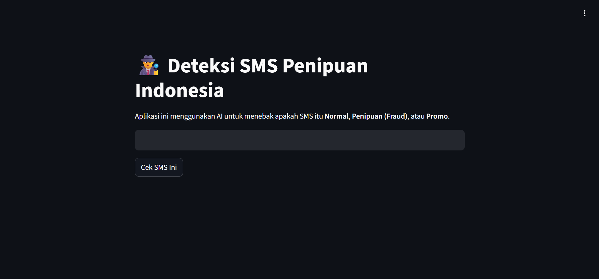

# 🕵️‍♂️ Deteksi SMS Penipuan Indonesia (Indonesian SMS Spam Detector)


Proyek ini adalah aplikasi **Machine Learning** sederhana untuk mendeteksi apakah sebuah SMS termasuk dalam kategori **Normal**, **Penipuan (Fraud)**, atau **Promo**. 

Dibangun menggunakan **Python**, **Scikit-Learn**, dan **Streamlit**, proyek ini bertujuan untuk membantu mengenali pola SMS spam yang marak di Indonesia menggunakan pendekatan *Natural Language Processing* (NLP).



## 🚀 Fitur Utama

* **Klasifikasi Teks Otomatis:** Mengkategorikan SMS ke dalam 3 label:
    * ✅ **Normal:** SMS percakapan sehari-hari.
    * 🚨 **Penipuan:** SMS modus minta pulsa, menang undian, dll.
    * 📢 **Promo:** SMS penawaran operator atau iklan.
* **Akurasi Tinggi:** Menggunakan algoritma **Multinomial Naive Bayes** dengan akurasi model mencapai **~91%**.
* **Web Interface:** Tampilan antarmuka yang ramah pengguna menggunakan Streamlit.
* **Confidence Score:** Menampilkan tingkat keyakinan (persentase) dari prediksi AI.

## 🛠️ Teknologi yang Digunakan

* **Language:** Python
* **Machine Learning:** Scikit-Learn (MultinomialNB)
* **Feature Extraction:** TF-IDF Vectorizer
* **Data Processing:** Pandas, NumPy
* **Visualization:** Matplotlib, Seaborn
* **Web Framework:** Streamlit

## 📊 Performa Model

Berdasarkan hasil pelatihan di Google Colab, model ini memiliki performa yang cukup baik untuk mendeteksi spam:

| Metric | Score |
| :--- | :--- |
| **Akurasi** | **91.70%** |
| **Precision (Penipuan)** | 97% |
| **Recall (Penipuan)** | 89% |

Model dilatih menggunakan dataset SMS Bahasa Indonesia yang terdiri dari **1.143** data teks.

## 📂 Struktur Project

* `SMS_Spam_Detector_Indonesia.ipynb`: Notebook eksperimen (Data Cleaning, Training, Evaluasi).
* `app.py`: Source code untuk aplikasi web Streamlit.
* `requirements.txt`: Daftar library yang dibutuhkan.

## 💻 Cara Menjalankan di Komputer Lokal

Ingin mencoba menjalankannya di laptop sendiri? Ikuti langkah ini:

1.  **Clone Repository**
    ```bash
    git clone [https://github.com/Ryonandha/sms-spam-detector-indonesia.git](https://github.com/Ryonandha/sms-spam-detector-indonesia.git)
    cd sms-spam-detector-indonesia
    ```

2.  **Ganti Branch ke `streamlit-app` (Penting!)**
    Karena file aplikasi ada di branch terpisah:
    ```bash
    git checkout streamlit-app
    ```

3.  **Install Dependencies**
    ```bash
    pip install -r requirements.txt
    ```

4.  **Jalankan Aplikasi**
    ```bash
    streamlit run app.py
    ```

5.  Buka browser di alamat yang muncul (biasanya `http://localhost:8501`).

## 🤝 Credits & Dataset

Dataset yang digunakan dalam proyek ini bersumber dari repositori publik SMS Spam Indonesia.
* **Dataset Source:** [Gist agtbaskara](https://gist.github.com/agtbaskara/a1a7017027cc1df9d35cf06e1e5575b7)

---
Created with  by **Ryonandha**
